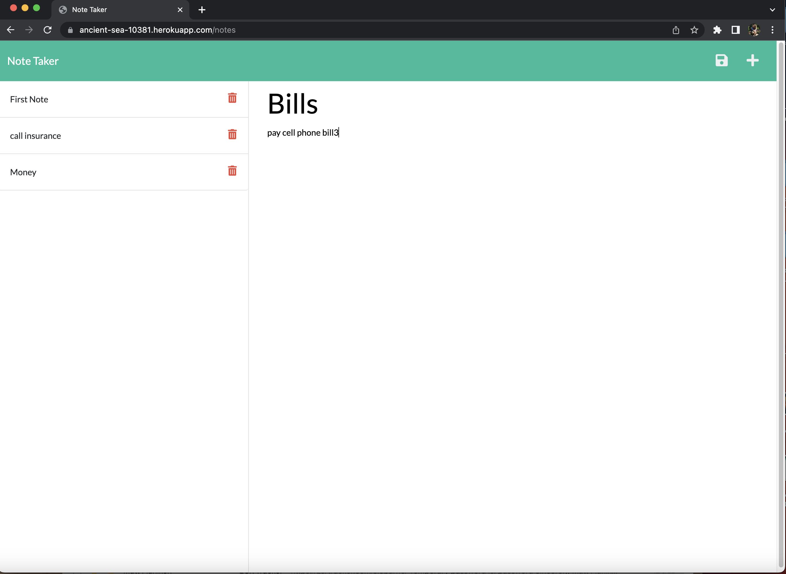

# Express JS Note Taker

## Description

I was wanting to connect the front end and back end together using routes so that I can use a note taking application to keep track of things to do.  When the application was first presented the data was unable to be used as there was nothing to handle any of the requests to be able to view the currently saved note as well being able to save or delete any notes.  While working on this application I was able to learn more about routes and how they are able to link the front and backends together rather than saving data to local storage.

## Installation

Opening the code in Visual studios code first you run npm i to install the package json.  After that run npm start to run it locally from port 3001.  When you open up an internet window you will see the note taker application with some prior notes saved and the capabilities to read that note, create a new note by typing in the title and text content then clicking on the save icon that looks like a floppy disk, as well as being able to delete notes by clicking on the trash can icon.

## Usage
The following is a link to the Heroku website [heroku deployed site](https://ancient-sea-10381.herokuapp.com/) 
You can go to the above site and first click on Get started.  From there on the left hand side there should be some notes already saved, by clicking on them you can view the text that is for each individual note.  If you would like to add a note input text into bothe the note title and note text and then click the floppy disk to save the note.  If you wish to delete a note then click on the trashcan icon to delete a specific note.

The following are some screen shots from site loadup initially and after you have clicked getting started.

